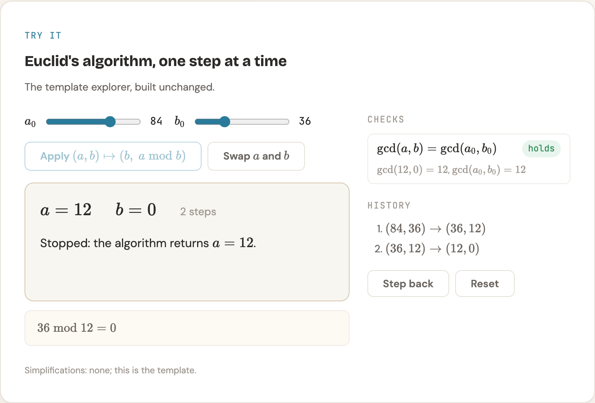
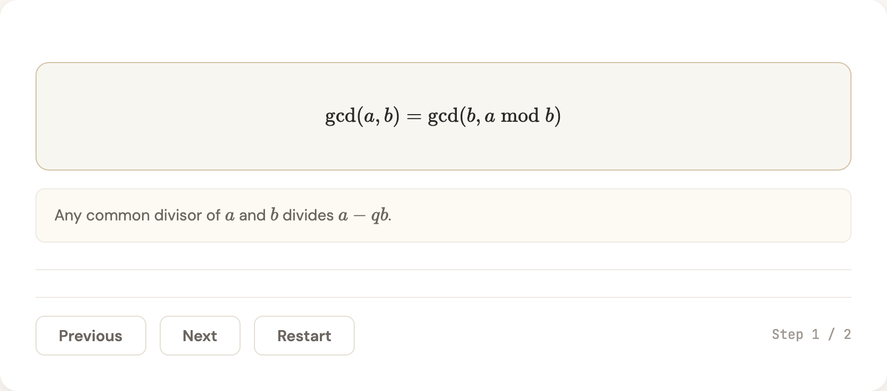

# paper-to-course

*A fork of [ZeroxZhang/paper-to-course](https://github.com/ZeroxZhang/paper-to-course), extended and hardened. See [Credits](#credits).*

**An agent skill that turns a research paper into an interactive, self-contained HTML course, written in the paper's own notation and checked in a real browser before it is called done.**

Give your agent a PDF or an arXiv link and ask it to "turn this paper into a course". You get a directory with an `index.html` that opens straight from disk: modules that build from background to the paper's contribution, step-by-step LaTeX derivations, pseudocode walkthroughs, quizzes, glossary tooltips, research lineage, and small working simulations of the paper's mechanisms that you can drive yourself.

<p align="center">
  
</p>

## What makes it different

- **The paper's notation, exactly.** Every symbol, subscript, operator and name is the one the paper uses, in prose, derivations, quizzes, simulations and diagrams. Names the paper does not give are derived from its notation and introduced explicitly. Every course with formal notation carries a notation table.
- **LaTeX everywhere.** All math is typeset with KaTeX, including tooltips, quiz answers, pseudocode and diagram labels (via `<foreignObject>`). KaTeX is bundled, so courses render offline.
- **Interactive explorers.** Where the paper has a mechanism with state (an algorithm, an update rule, a protocol, a calculus, the objects of a theorem), the agent builds a small simulation of it: buttons apply the paper's operations, the state renders in the paper's notation, and the paper's invariants are checked live. An explorer that illustrates a theorem must be able to reach the case where the theorem's condition fails, so you can see what the condition protects.
- **Never shipped broken.** `scripts/check-course.py` loads the course in a headless browser, clicks through every widget and fails on console errors, dead widgets, KaTeX errors, raw LaTeX, clipped diagram labels, navigation mismatches and scroll hijacking. The agent is told a course is not finished until the check passes, and to inspect a screenshot of every diagram.
- **Restrained design.** A warm "research notebook" look with no emoji, no callout boxes and no decorative stripe borders. Native scrolling.
- **Reviewed in place with Lavish.** The finished course is always handed over through [Lavish Editor](https://www.npmjs.com/package/lavish-axi) (`npx lavish-axi`): you read it in your browser, annotate any element or passage, and send the feedback back; the agent fixes the source, rebuilds, re-runs the check and replies on the page, round after round.
- **Your language.** The skill is written in English; the course is written in the language you ask in, with the interface strings translated to match.

<p align="center">
  
</p>

## Install

Copy this directory into a location your agent loads skills from, for example a project's `.claude/skills/paper-to-course/` for Claude Code. Then ask:

> turn ./paper.pdf into a course

> make a course from https://arxiv.org/abs/xxxx.xxxxx, pages 1-20 only

Requirements: Node.js for `npx lavish-axi` (the review surface; no global install, `npx` fetches it), and for the browser check [uv](https://docs.astral.sh/uv/) (or any Python with `playwright` installed) and Playwright's Chromium:

```bash
uv run --no-project --with playwright playwright install chromium
```

## How it works

1. **Deep reading.** The agent extracts the paper's notation inventory, equations with their numbers, definitions and theorems with their exact conditions, algorithms, results and mechanisms worth simulating.
2. **Background.** It identifies the prerequisites a curious practitioner is missing and how the paper relates to prior work.
3. **Curriculum.** 5-8 modules (more for long papers) that follow the paper's own structure, from Module 0 (background and notation) to the critical outlook, with explorers planned where they earn their place.
4. **Build.** `scripts/new-course.sh` scaffolds the course directory; the agent writes the cover, one HTML file per module and one script per explorer, then `build.sh` assembles `index.html`. Complex papers are written in parallel from per-module briefs.
5. **Check.** `scripts/check-course.py` runs, every failure is fixed and the diagram screenshots are inspected.
6. **Review.** The course is served with `npx lavish-axi`; your annotations come back to the agent, which applies them to the source, rebuilds, re-checks and replies, until you end the session.

## Repository layout

```
SKILL.md                         the instructions the agent follows
references/
  content-philosophy.md          teaching principles, notation fidelity, quizzes, tooltips
  gotchas.md                     failure modes to avoid
  interactive-elements.md        HTML pattern for every component
  interactive-demo.md            when and how to build explorers
  explorer-template.js           a working explorer to start from
  design-system.md               tokens, typography, SVG conventions
  module-brief-template.md       per-module brief for complex papers
  _base.html _footer.html build.sh styles.css main.js
  vendor/katex/                  KaTeX 0.16.47 (MIT), woff2 fonts only
scripts/
  new-course.sh                  scaffold a course directory
  check-course.py                headless browser check
tests/
  run.sh                         a fixture that must pass and a broken one that must fail
```

Run the skill's own tests with `bash tests/run.sh`.

## Credits

This project is a fork of **[paper-to-course](https://github.com/ZeroxZhang/paper-to-course) by ZeroxZhang**, licensed under the Apache License 2.0. The course structure, the teaching philosophy (intuition before formalism, background before the paper's contribution), the design system and most of the interactive components come from that project, and its full git history is preserved here. Thank you to its author for the foundation.

The interactive explorer is modelled on the "interactive HTML explorer" idea in **[claude-paper](https://github.com/alaliqing/claude-paper) by alaliqing** (MIT License). No code was taken from it.

Math rendering uses **[KaTeX](https://katex.org)** (MIT License), bundled under `references/vendor/katex/`.

### Changes from upstream

- Fixed a load-time crash in `main.js` that left every widget in generated courses dead, plus several engine bugs (pseudocode buttons never wired, math not rendered in tooltips and feedback, globally scoped ablation lookups).
- Added the headless browser check, the skill's own tests and the scaffold script.
- Added interactive explorers.
- Required the paper's exact notation and LaTeX everywhere, including diagrams; bundled KaTeX instead of loading it from a CDN.
- Removed callouts, stripe borders and emoji from the design; replaced scroll snapping and arrow-key module jumps with native scrolling.
- Translated the skill to English and made the course follow the user's language instead of defaulting to Simplified Chinese.

See `NOTICE` and the git history for the complete record.

## License

Apache License 2.0, as upstream. See `LICENSE` and `NOTICE`.
